<p align="center">
  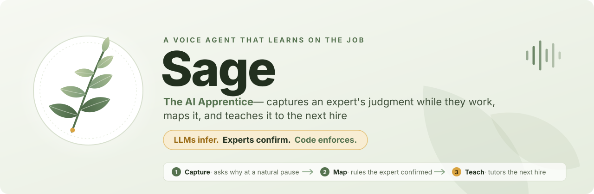
</p>

<p align="center">
  <a href="#-demo-video"><b>▶ Demo video</b></a> ·
  <a href="#-the-apprentice-test">The Apprentice Test</a> ·
  <a href="#-architecture">Architecture</a> ·
  <a href="#-results">Results</a> ·
  <a href="#-run-it">Run it</a>
</p>

<p align="center">
  
  
  
  
  
  
</p>

> **Hack-Nation × ElevenLabs — 7th Global AI Hackathon · Challenge 01: The AI Apprentice**
>
> Recorders capture *what* happened. **Sage learns the decision boundary behind it**, asks the expert to confirm every rule in their own words, and proves the knowledge transfers by **stopping a new hire's mistake on a case the expert never showed.**

---

## ▶ Demo video

> **[ ▶ Watch the demo — link to be added before submission ](#)**  <!-- TODO: replace # with the YouTube / Loom link -->

---

## The problem, and our workflow

Experienced reviewers carry decades of judgment that was never written down. Screen recordings show the clicks, not the reasons, and the guardrails (the limit, the exception, the moment to stop and ask) are learned by breaking them.

We built Sage on a workflow with real judgment calls: **KYC onboarding review** at a fictional bank, under the *Northstar Bank Synthetic Review Policy* (all data is synthetic). An expert works customer cases in **CaseDesk**, our sandbox review app, deciding between *approve*, *request documents*, *enhanced review*, *escalate to compliance* and *reject*, based on ownership, country risk, PEP status, sanctions hits, adverse media, source of funds and more.

<p align="center">
  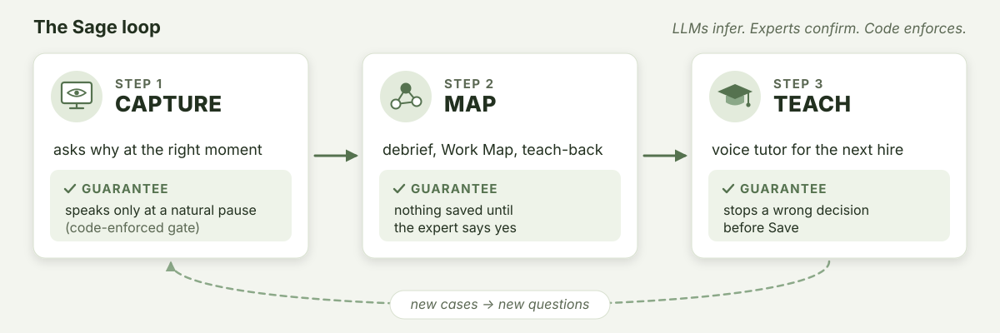
</p>

---

## What Sage does

### 1 · Capture — an apprentice that asks *why*, at the right moment

The expert shares their screen and works a real case. An ElevenLabs voice agent listens in a side panel and **stays silent while they type, read or talk**. At a natural pause it asks one short question about what just happened on screen:

> *"What led you to send this one to enhanced review?"*
> *"If the entity were an individual instead of a company, with the owner still at 100%, would that change your call?"*

<p align="center">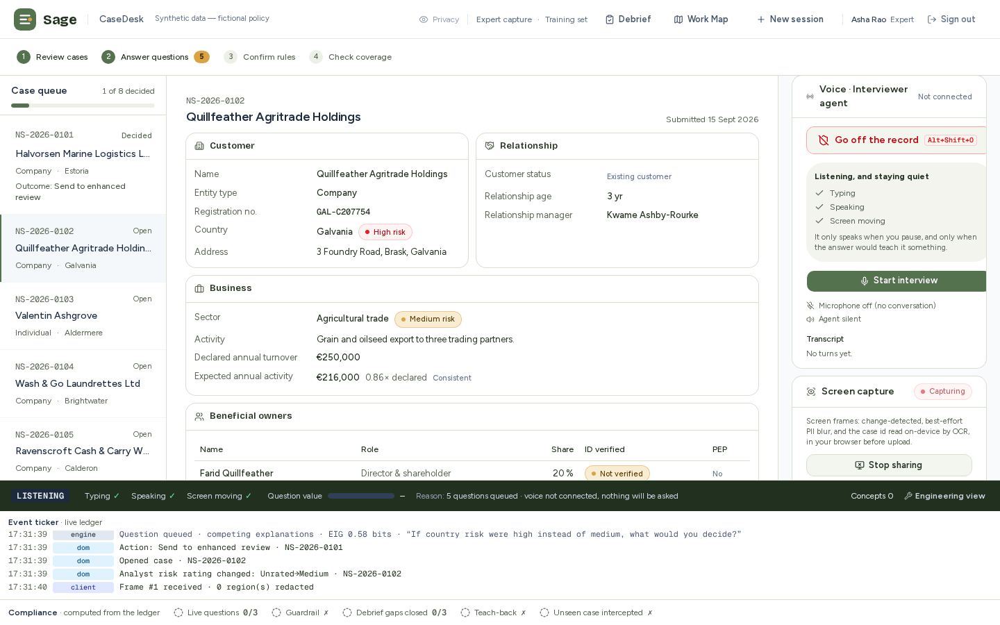</p>

- **When to speak is decided by code, not by the LLM.** A deterministic gate authorises speech only when the expert has been silent for 1.2 s, the screen has been idle for 1.5 s, there has been no keystroke for 1.5 s, the work is at a breakpoint, the question is worth asking (≥ 0.3 bits), and the budget allows it (5 per 10 minutes). The voice agent's LLM is **our own endpoint**: it stays silent (`skip_turn`) unless it receives a single-use, gate-issued nonce, and then it speaks exactly the authorised text.
- **What to ask is computed.** A hypothesis engine scores how *surprising* each decision is under the candidate rules, and picks the question with the highest **expected information gain**: a why-probe, or a counterfactual that moves one on-screen feature across a threshold. It never asks what the screen already answers.
- **Answers become candidate rules, not facts.** Sonnet parses each answer into a structured rule. It is only a *proposal* until the expert confirms it with their own words.

<p align="center">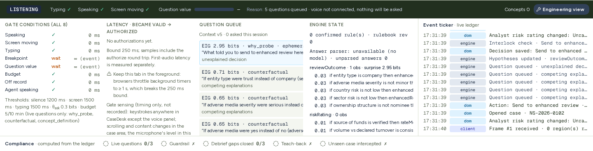</p>

### 2 · Map — a debrief that closes the gaps, then teaches back

When the task ends, Sage runs a **short debrief conversation**, by voice or chat. It already knows where its understanding is thin:

- **Z3 searches for counterexamples** in what it has learned: valid cases that no rule decides, two rules that conflict, or a rule sitting exactly on a threshold. Each one becomes a concrete question: *"Country risk medium, politically exposed person: yes — send to enhanced review or request documents?"*
- It asks about **decisions it can't yet explain**, naming the case's facts, and about **hard stops**: *"Is there anything you would never allow, whatever the case?"*
- **Free answers are read back before anything is saved.** *"So the hard stop is: when sanctions screening match is yes, never approve onboarding. Save it?"* Only a plain "yes" saves it, and the rule keeps the expert's exact words.
- It ends with a **teach-back**, the whole process explained in its own words, that the expert confirms or corrects. A correction revises the rule (revision +1, with an animated diff), and the solver runs again.
- **"When has it understood?"** has a precise answer: every observed decision is explained, Z3 finds no unresolved counterexample under the current feature model, there are no undefined concepts, and the teach-back is confirmed.

<p align="center">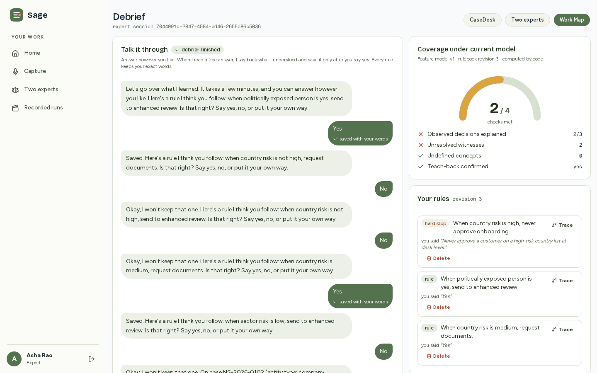</p>

The result is the **Work Map**: a clickable map where every step shows the redacted screen moment, the decision, the reason in the expert's exact words, and the guardrails around it. **Trace** any rule back through the ledger: screen frame → screen event → decision → question → answer → confirmed rule.

<table>
  <tr>
    <td width="50%">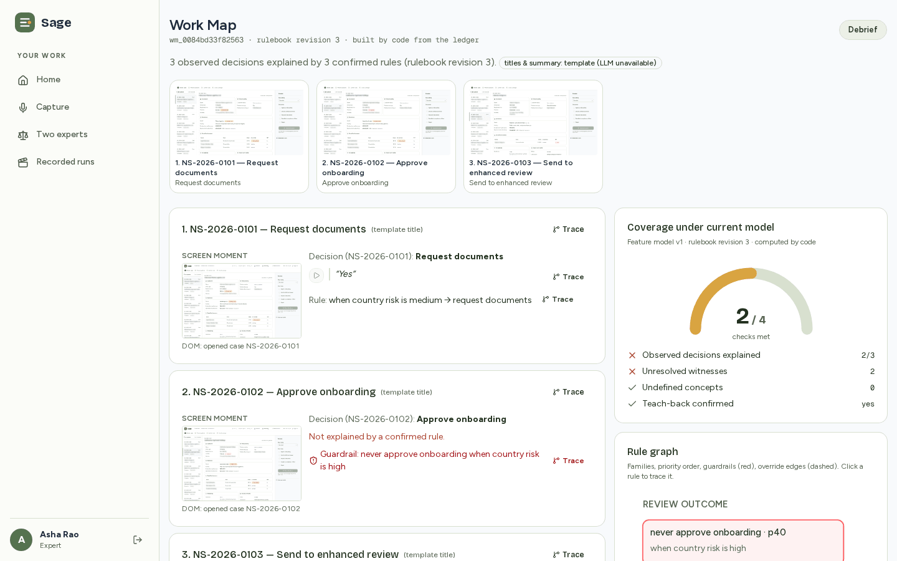</td>
    <td width="50%">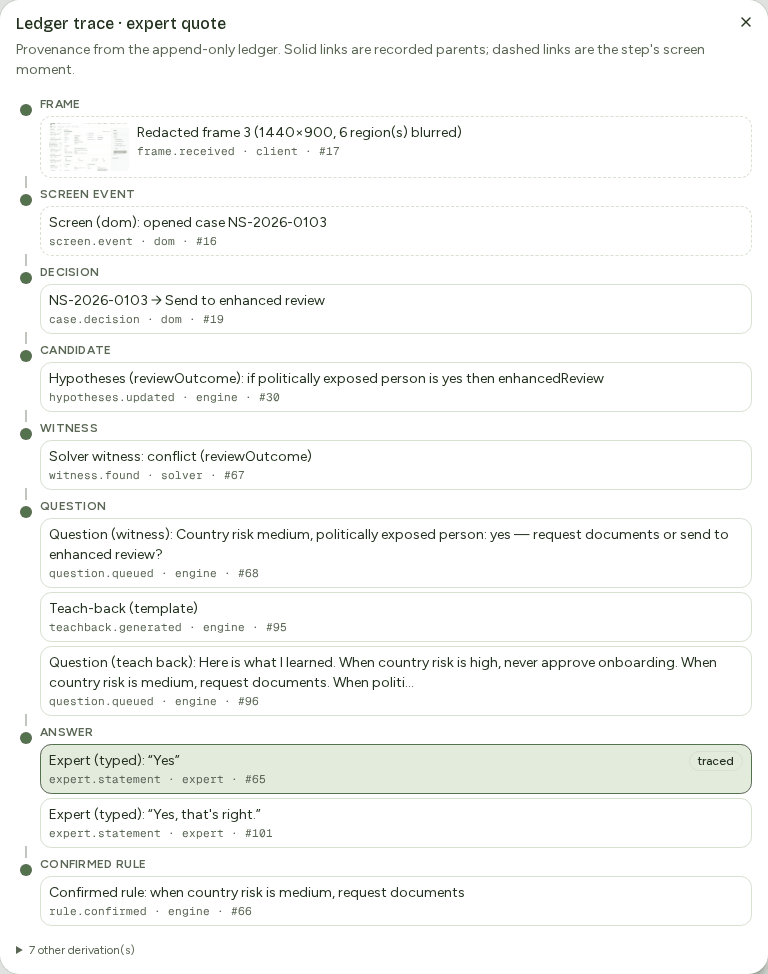</td>
  </tr>
</table>

### 3 · Teach — a voice tutor that stops the mistake *before* it's saved

A new hire works **cases the expert never showed**, on their own screen. The tutor:

- asks them to **predict** the expert's decision, then reveals it **in the expert's words**;
- **steps in before a guardrail is broken.** On held-out case NS-2026-0201 (a *new* company in a *high-risk* country), the trainee picks *Approve*. Before they can save, the tutor says *"Careful — the expert's rule forbids 'Approve onboarding' here"*, quotes the expert, and the **Save interlock** blocks the commit;
- coaches by voice or chat, grounded only in confirmed rules; a code check rejects any reply that cites an unseen rule or misquotes the expert;
- tracks a **mastery ladder** (untested → assisted → correct once → correct at the boundary → mastered), so it can show what the new hire has mastered and what to practise next.

<table>
  <tr>
    <td width="50%">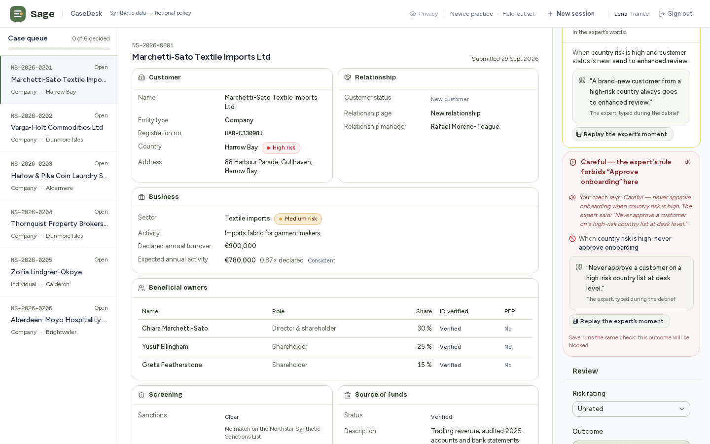</td>
    <td width="50%">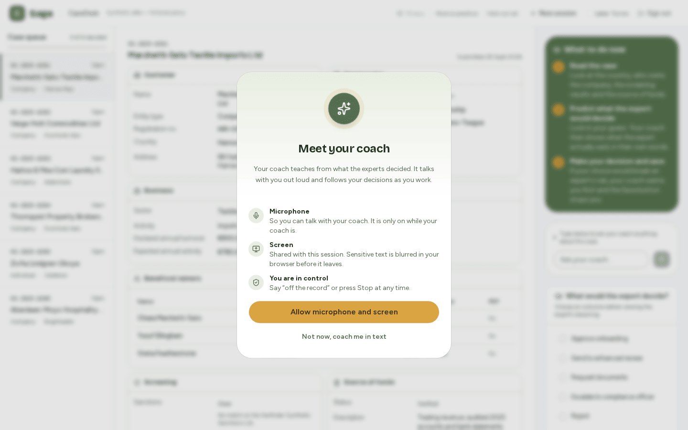</td>
  </tr>
</table>

---

## ✅ The Apprentice Test

| The brief asks | How Sage answers it | Proof |
|---|---|---|
| **When to ask** — how does it know the expert paused, and stay quiet while they type, read or talk? | A deterministic gate (silence · screen idle · typing idle · breakpoint · value · budget · off-record) is the **only** authority for speech. The LLM endpoint speaks only with a valid single-use nonce, and otherwise streams `skip_turn`. | **0 interruptions in 5 live runs** (re-run). Gate decision p50 0 ms. An unauthorised turn stays silent for 8 s (live preflight). |
| **What to ask** — a question that reveals a reason or a guardrail, not one the screen answers | Surprise (`−log₂ Σ w·P(a\|h)`) flags decisions that contradict what it believed. **Expected information gain** chooses the question, and counterfactuals respect domain constraints. | Apprentice-Bench: **0.990 fidelity from 8 questions** vs 0.645 for record-only (below). |
| **When it has understood** — how does the debrief know it's done, and prove it? | Four checks: decisions explained · **Z3 finds no unresolved counterexample** · no undefined concepts · teach-back confirmed. It claims coverage *under the current feature model*, never "complete knowledge". | Coverage closed on all four criteria in the debrief e2e. The solver's encoding is exact, so "no witness" is a proof under the model. |
| **Whether the new hire learned** — handling a new case alone | Held-out cases the expert never showed, predict-then-reveal, interventions before Save, and a mastery ladder. | Tutor catches the wrong *Approve* on unseen **NS-2026-0201** before Save (e2e). Interlock: **132/132** violating commits blocked (property test). |
| **Trust** — off the record, personal data | "Off the record" (a phrase or a button) mutes the mic first, stops capture, cancels queued uploads and voids in-flight speech authorisations; only a marker is stored, never the words. Screen frames are **PII-blurred in the browser** (on-device OCR) before upload. All data is synthetic. Every rule needs the expert's sign-off in their own words, and an admin can never confirm a rule. | Live preflight: the off-record phrase triggers `set_off_record` in 556 ms, with no speech for 8 s. Server refuses capture while off the record (409). |

---

## The brief's checklist

| Requirement | Status | Evidence |
|---|---|---|
| **Capture:** ≥3 questions during a real task, each at a natural pause, about something on screen | ✅ **Met live** (voice). 26 authorised, 26 spoken, 0 interruptions across 5 runs. | `docs/evidence/live/rerun-2026-10-04/` |
| **Capture:** ≥1 question about a guardrail | ◐ **Met live through a why-probe** on the PEP case, which produced *"Never approve a politically exposed person without compliance sign-off"* (a `require_approval` guardrail). The explicit "hard stop" question lives in the debrief. | `docs/evidence/live/rerun-2026-10-04/ACCEPTANCE.txt` |
| **Map:** debrief with ≥3 follow-ups not answered during the task, ending in a confirmed teach-back | ✅ **Met in end-to-end tests** (Z3 found 4 gaps; coverage closed). The debrief voice path is built and tested with a simulated voice SDK; a live spoken debrief is next. | `apps/web/e2e/debrief.spec.ts`, `docs/evidence/p5/` |
| **Map:** every step and guardrail links to a screen moment and the expert's words | ✅ Every confirmed rule *must* carry the exact quote, its timestamps and a screen frame; this is enforced by the type system and by promotion checks. | `docs/evidence/live/p8/workmap-*.json` |
| **Teach:** an unseen case; the tutor catches a wrong decision before Save, in the expert's reasoning | ✅ **Met in end-to-end tests** on held-out NS-2026-0201; live, the same rulebook blocked a **real Claude agent** via MCP on that case, citing the expert's quote. | `apps/web/e2e/tutor.spec.ts`, `docs/evidence/live/p8/agent-blocked-live.txt` |
| **Stretch: two experts, one task** | ✅ **Met in end-to-end tests.** Z3 finds a case where two experts' rulebooks disagree and asks each one why. While it is open, the disputed decision rules are held back and every safety rule still applies, so it can only make checks stricter. | `docs/evidence/p10/two-experts-*.png` |
| **Stretch: any language** | ✅ **Met live:** a Hindi-speaking expert (real ElevenLabs ASR) → verified translation → rule with the Hindi quote and an English translation → English tutor and MCP cite it. | `docs/evidence/live/rerun-2026-10-04/hindi/` |
| **Stretch: agent-ready guardrails** | ✅ **Met live:** an MCP `check_action` server, Work Map JSON, and an ElevenLabs Procedure export. A real Claude agent was blocked in production; MCP agrees with the human interlock on 55/55 cases. | `docs/evidence/live/p8/` |

*In every live run the expert's voice was synthetic (ElevenLabs TTS), so the runs are repeatable and scripted. The live system, ASR, agents and models were real.*

---

## 🏗 Architecture

<p align="center">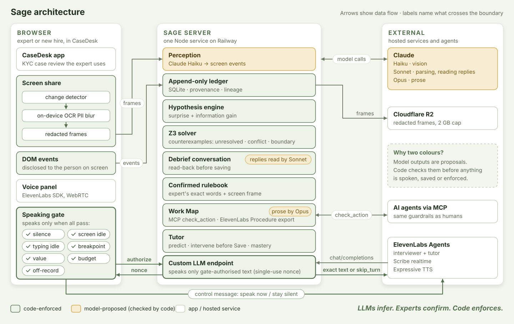</p>

**One principle runs through all of it: LLMs infer, experts confirm, code enforces.** Models propose: they read the screen, parse answers, phrase questions and write prose. Every decision that matters is code: when to speak, what counts as a rule, whether a case is covered, whether an action is allowed.

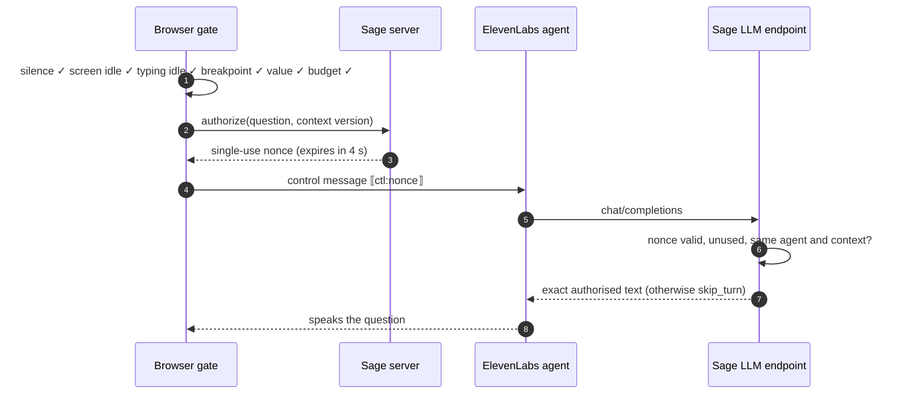

<details>
<summary><b>Technical depth — the parts we're proudest of</b></summary>

- **Speaking gate + nonce invariant.** A pure reducer/evaluator/controller. The nonce goes issued → in-flight → used; an aborted stream releases it for ElevenLabs' retry. A spoken nonce may be re-spoken with the *same text* for 10 s, then is refused. Control text is stored as `system_control` and can never become evidence. Tested by fast-check properties plus a mutation check that broke each guard in turn.
- **Hypothesis engine.** A deterministic rule enumerator (≤2 conditions, grouped prior ∝ exp(−λ·complexity)), Bayesian weights, surprise, and EIG computed as mutual information. LLM-proposed latent concepts enter the feature model only after the expert confirms them.
- **Z3 counterexamples** (worker thread, WASM): unresolved cells, precise conflicts, boundary witnesses, two-expert disagreements and practice cases, all within typed bounds and domain constraints. Every witness is re-checked with a three-valued (Kleene) evaluator.
- **Append-only ledger with provenance.** SQLite with triggers that forbid updates and deletes, gap-free per-session sequences, and parent links. Lineage walks run as recursive queries. A `ConfirmedRule` *requires* expert-quote evidence (exact words, timestamps, frames).
- **Debrief conversation.** Code reads plain yes/no/skip. Sonnet reads free answers with a public-domain-only prompt; code checks ids, converts conditions and type-checks them, reads them back, and saves only on a plain "yes". Near-duplicate proposals (the same rule at another threshold) are asked about once.
- **Verified replay.** Any real run exports to an immutable bundle with a sha256 per file and a **hash chain** over the ledger. Replay re-verifies on every load and refuses a single changed byte, then renders through the *same* UI components.
- **Agent-ready guardrails.** An MCP `check_action` server over Streamable HTTP uses the same deterministic `checkAction` as the human Save interlock: no model, no clock, no randomness.
- **Perception.** Change detection (frame diff + dHash) → on-device Tesseract OCR PII pixelation → an ordered, coalescing upload queue → Claude Haiku structured screen events. Redacted frames go to private Cloudflare R2 storage with a 2 GB cap.
- **The hidden oracle stays hidden.** The benchmark's ground-truth policy is server/bench-only; a build test proves it never reaches the browser bundle, and every Claude call refuses a prompt that carries it.

</details>

---

## 📊 Results

**Apprentice-Bench.** A deterministic benchmark: a hidden-policy program plays the expert, and we measure how well each questioning strategy learns its policy, on 500 held-out cases × 5 seeds (`pnpm bench`, `docs/evidence/bench/report.md`).

| Strategy | Questions asked | Fidelity on held-out cases | Unsafe approvals missed |
|---|---|---|---|
| A · Record only (task mining) | 0 | 0.645 | 14.6% |
| B · Ask "why" at every step | 16–24 | 0.949 | 0.0% |
| C · Interview templates (ACTA) | 12+ | 0.940 | 4.1% |
| **D · Sage** (surprise + information gain + Z3) | **8** | **0.990** | **1.2%** |

Sage reaches the best fidelity with a third of the questions. Honest caveats: asking "why" at every step (B) is safer at budgets ≥ 12 but costs many more interruptions, and the simulated expert's answers are exact, an upper bound.

**Live system** (production, real ElevenLabs agents and Claude models; synthetic expert voice):

| Measure | Result |
|---|---|
| Interruptions while the expert works | **0** across 5 live runs (re-run) |
| Questions authorised → spoken | 26 → 26 |
| Gate decision latency | p50 **0 ms** (first run p95 3 ms) |
| Control message → first agent audio | p50 **691 ms**, p95 780 ms |
| Unauthorised turn | silent for 8 s (`skip_turn` in 338 ms) |
| Rules confirmed by voice with valid evidence | **6/6** |
| Hindi → English rule, live ASR | ✅ |
| Real Claude agent blocked through MCP | ✅ citing the expert's quote |
| Test suite | **1711** unit · **23/23** browser · **9/9** live preflight ([report](docs/evidence/preflight-2026-10-04T12-07-06.227Z.json)) |

<details>
<summary><b>More screens: two experts, verified replay</b></summary>

<table>
  <tr>
    <td width="50%">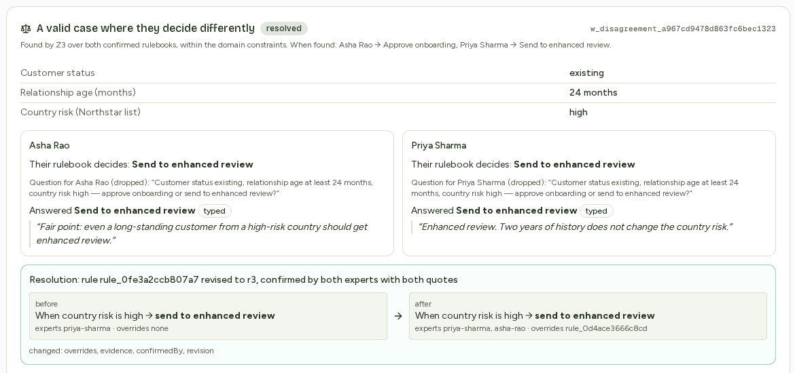</td>
    <td width="50%">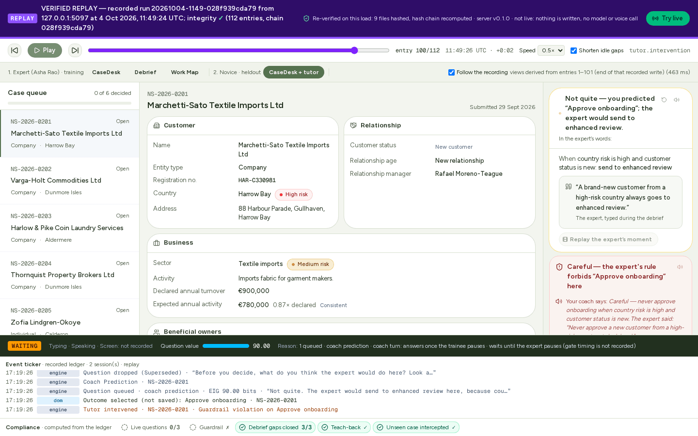</td>
  </tr>
</table>

</details>

---

## 🌱 The moonshot

**Today:** one expert → a verified rulebook → a tutor for the next hire *and* a guardrail for AI agents, from the same rules.

**Next:** a **living company memory**: every expert's rulebook in one map that stays current. When the work changes, Sage asks only about what's new, because it knows exactly which cases its rules don't decide yet (Z3). After that, an **always-on apprentice** that notices a case it has never seen during normal work and asks one question at the right moment.

**Then:** **a verified organisational judgment layer.** Every human and every AI agent decides routine cases from the same expert-approved rules, with an audit trail from each decision back to the expert's words and the screen moment they were said. People keep the judgment calls, and agents take the routine steps safely.

---

## 🚀 Run it

**Live:** https://vashistha-production.up.railway.app. Sign-in is required: sign up, and an admin grants the expert role. A walkthrough for the demo is in [`docs/demo/expert-cue-card.md`](docs/demo/expert-cue-card.md).

**Locally** (Node ≥ 22, pnpm):

```sh
pnpm install
cp .env.example .env          # ANTHROPIC_API_KEY, ELEVENLABS_API_KEY, agent ids, CUSTOM_LLM_SECRET, PUBLIC_BASE_URL
pnpm agents:sync              # creates / updates the two ElevenLabs agents from agents/*.json
pnpm --filter @vashistha/web dev
```

Without any keys, `LLM_CALLS=off` runs the app hermetically: no model or voice calls, and everything else works.

| Command | What it does |
|---|---|
| `pnpm check` | typecheck · lint · unit tests · bundle check (the hidden oracle never ships to the browser) |
| `pnpm test:e2e` | production build + 23 Playwright browser tests |
| `pnpm bench` | Apprentice-Bench, deterministic (byte-identical results) |
| `pnpm preflight` | 9 live checks against a deployment, including real ElevenLabs voice |
| `pnpm replay:export` | export a verified replay bundle from a real run |

<details>
<summary><b>Repository map</b></summary>

| Path | What's there |
|---|---|
| `apps/web` | Next.js 16 app + custom Node server: CaseDesk, debrief, Work Map, tutor, replay, admin, the custom-LLM endpoint |
| `packages/core` | schemas, the KYC domain, hypothesis engine, speaking gate, Work Map builder, ledger, `checkAction` |
| `packages/solver` | Z3 encoding and counterexample queries |
| `packages/perception` | change detector, ordered upload queue, on-device OCR PII redaction, screen-event extraction |
| `packages/mcp-guardrails` | MCP `check_action` server, Work Map JSON and ElevenLabs Procedure exports |
| `bench` | Apprentice-Bench: hidden-policy oracle, simulated expert, strategies, metrics |
| `agents` | versioned ElevenLabs agent specs (interviewer with a Hindi preset, tutor) |
| `docs/evidence` | every measurement, live run, screenshot and log behind the claims above |
| `plan.md` · `PROGRESS.md` | the spec, and a phase-by-phase log with measured results and misses |

**Stack:** TypeScript (strict) · Next.js 16 · React 19 · Tailwind 4 · ElevenLabs Agents (WebRTC, Scribe realtime, `eleven_v3_conversational`, custom LLM) · Claude Haiku 4.5 / Sonnet 5.5 / Opus 5.5 · Z3 · SQLite + Drizzle · Tesseract.js · MCP SDK · Cloudflare R2 · Railway · Vitest · fast-check · Playwright.

</details>

---

## Honest limitations

- **Vision from raw frames is measured but not yet good enough.** The best run reached 0.846 field recall and 0.857 action recall against a 0.95 target (false-critical rate and latency passed). Production therefore senses through the disclosed DOM channel, with vision running alongside for measurement.
- **Live voice coverage.** Capture questions, Hindi, and the MCP block ran live. The debrief and tutor flows are proven in end-to-end tests (the debrief by typed and simulated-voice answers); a full live spoken debrief and tutor run is next.
- **One spoken answer, one rule.** A long answer that lists many rules saves the first; the rest are asked for one at a time.
- **One synthetic domain and policy so far.** The benchmark's simulated expert answers exactly (an upper bound), and the human usability study (n = 2–3) has not been run yet.

Everything above links to its evidence in [`docs/evidence/`](docs/evidence/), and [`PROGRESS.md`](PROGRESS.md) records each phase's goal, results and misses.
