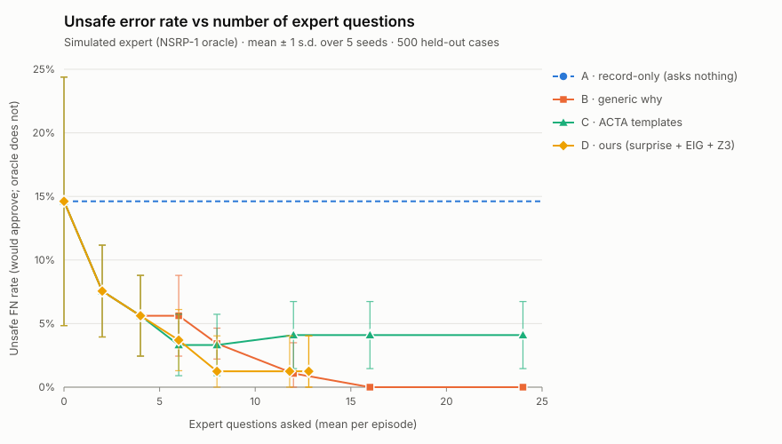
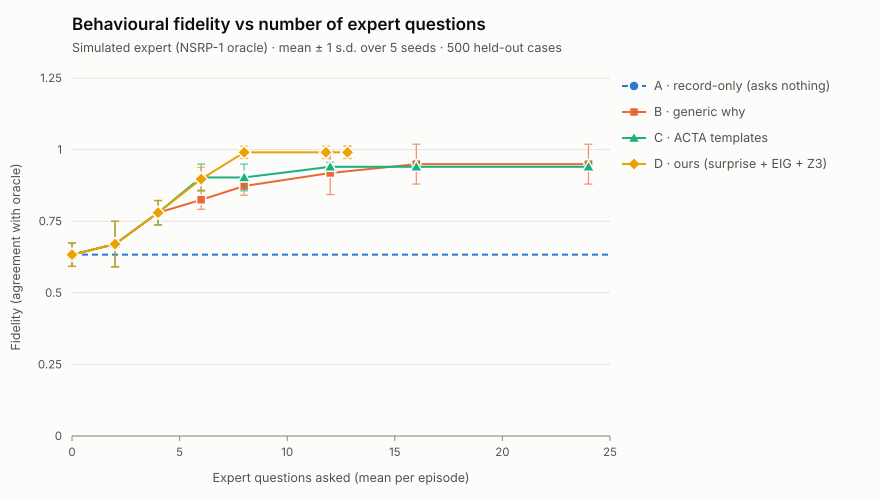

# Apprentice-Bench results

> **Simulation disclaimer.** The "expert" in this benchmark is a deterministic program that answers
> from NSRP-1, a fictional hidden policy for a fictional bank (plan §9). No person was asked anything;
> no number here is a human-subject result. Human testers, if any, are reported separately as an
> internal demonstration, not a powered learning study.

Generated by `pnpm bench` in **7.5 s** wall time (24 worker threads).
Every number below is a deterministic function of the configuration in `results.json` (seeds 1001, 1002, 1003, 1004, 1005):
re-running produces an identical `results.json`.

## Findings (computed from the table)

- D has the lowest (or tied lowest) mean unsafe FN rate at 3 of 7 non-zero budgets (budgets 2, 4, 8).
- D has the highest (or tied highest) mean fidelity at 6 of 7 non-zero budgets (budgets 2, 4, 8, 12, 16, 24).
- Budget 2: lowest unsafe FN 7.6% by B/C/D; highest fidelity 0.670 by B/C/D; D: unsafe FN 7.6%, fidelity 0.670, 2.0 questions asked, 2.0 interruptions.
- Budget 4: lowest unsafe FN 5.6% by B/C/D; highest fidelity 0.780 by B/C/D; D: unsafe FN 5.6%, fidelity 0.780, 4.0 questions asked, 4.0 interruptions.
- Budget 6: lowest unsafe FN 3.3% by C; highest fidelity 0.903 by C; D: unsafe FN 3.7%, fidelity 0.897, 6.0 questions asked, 5.8 interruptions.
- Budget 8: lowest unsafe FN 1.2% by D; highest fidelity 0.990 by D; D: unsafe FN 1.2%, fidelity 0.990, 8.0 questions asked, 7.0 interruptions.
- Budget 12: lowest unsafe FN 1.1% by B; highest fidelity 0.990 by D; D: unsafe FN 1.2%, fidelity 0.990, 11.8 questions asked, 7.8 interruptions.
- Budget 16: lowest unsafe FN 0.0% by B; highest fidelity 0.990 by D; D: unsafe FN 1.2%, fidelity 0.990, 12.8 questions asked, 7.8 interruptions.
- Budget 24: lowest unsafe FN 0.0% by B; highest fidelity 0.990 by D; D: unsafe FN 1.2%, fidelity 0.990, 12.8 questions asked, 7.8 interruptions.
- At budget 24, D stopped early: 12.8 questions on average (no unasked Z3 witness with EIG ≥ θ left: coverage closed under the learned rules).
- Seeds with any unsafe approval at budget 24: A 5/5, B 0/5, C 5/5, D 1/5 (the means above average over seeds; one bad seed moves them).
- Floor (A, no questions): fidelity 0.645, unsafe FN 14.6%, guardrail recall 99.5%.
- Worse than the floor on a safety metric: B at budget 2 (guardrail recall 94.1%, unsafe FN 7.6%); C at budget 2 (guardrail recall 94.1%, unsafe FN 7.6%); D at budget 2 (guardrail recall 94.1%, unsafe FN 7.6%).

## Main results (precise expert: noise 0, vagueness 0)

Mean ± sample standard deviation over 5 seeds; 24 observed decisions and 500 held-out cases per episode.

| Budget | Strategy | Fidelity | Unsafe FN rate | Guardrail recall | Rules recovered (of 7) | Questions (why / cf) | Interruptions |
|---:|---|---:|---:|---:|---:|---:|---:|
| 0 | A · record-only | 0.645 ± 0.031 | 14.6% ± 9.8% | 99.5% ± 1.0% | 1.8 ± 0.4 | 0.0 (0.0 / 0.0) | 0.0 ± 0.0 |
| 0 | B · generic why | 0.645 ± 0.031 | 14.6% ± 9.8% | 99.5% ± 1.0% | 1.8 ± 0.4 | 0.0 (0.0 / 0.0) | 0.0 ± 0.0 |
| 0 | C · ACTA templates | 0.645 ± 0.031 | 14.6% ± 9.8% | 99.5% ± 1.0% | 1.8 ± 0.4 | 0.0 (0.0 / 0.0) | 0.0 ± 0.0 |
| 0 | D · ours (surprise + EIG + Z3) | 0.645 ± 0.031 | 14.6% ± 9.8% | 99.5% ± 1.0% | 1.8 ± 0.4 | 0.0 (0.0 / 0.0) | 0.0 ± 0.0 |
| 2 | A · record-only | 0.645 ± 0.031 | 14.6% ± 9.8% | 99.5% ± 1.0% | 1.8 ± 0.4 | 0.0 (0.0 / 0.0) | 0.0 ± 0.0 |
| 2 | B · generic why | 0.670 ± 0.079 | 7.6% ± 3.6% | 94.1% ± 2.1% | 2.6 ± 0.5 | 2.0 (2.0 / 0.0) | 2.0 ± 0.0 |
| 2 | C · ACTA templates | 0.670 ± 0.079 | 7.6% ± 3.6% | 94.1% ± 2.1% | 2.6 ± 0.5 | 2.0 (2.0 / 0.0) | 2.0 ± 0.0 |
| 2 | D · ours (surprise + EIG + Z3) | 0.670 ± 0.079 | 7.6% ± 3.6% | 94.1% ± 2.1% | 2.6 ± 0.5 | 2.0 (2.0 / 0.0) | 2.0 ± 0.0 |
| 4 | A · record-only | 0.645 ± 0.031 | 14.6% ± 9.8% | 99.5% ± 1.0% | 1.8 ± 0.4 | 0.0 (0.0 / 0.0) | 0.0 ± 0.0 |
| 4 | B · generic why | 0.780 ± 0.043 | 5.6% ± 3.2% | 100.0% ± 0.0% | 5.0 ± 0.0 | 4.0 (4.0 / 0.0) | 4.0 ± 0.0 |
| 4 | C · ACTA templates | 0.780 ± 0.043 | 5.6% ± 3.2% | 100.0% ± 0.0% | 5.0 ± 0.0 | 4.0 (4.0 / 0.0) | 4.0 ± 0.0 |
| 4 | D · ours (surprise + EIG + Z3) | 0.780 ± 0.043 | 5.6% ± 3.2% | 100.0% ± 0.0% | 5.0 ± 0.0 | 4.0 (4.0 / 0.0) | 4.0 ± 0.0 |
| 6 | A · record-only | 0.645 ± 0.031 | 14.6% ± 9.8% | 99.5% ± 1.0% | 1.8 ± 0.4 | 0.0 (0.0 / 0.0) | 0.0 ± 0.0 |
| 6 | B · generic why | 0.825 ± 0.033 | 5.6% ± 3.2% | 100.0% ± 0.0% | 5.4 ± 0.5 | 6.0 (6.0 / 0.0) | 6.0 ± 0.0 |
| 6 | C · ACTA templates | 0.903 ± 0.047 | 3.3% ± 2.4% | 100.0% ± 0.0% | 6.0 ± 0.0 | 6.0 (5.0 / 1.0) | 5.0 ± 0.0 |
| 6 | D · ours (surprise + EIG + Z3) | 0.897 ± 0.041 | 3.7% ± 2.4% | 100.0% ± 0.0% | 6.2 ± 0.4 | 6.0 (5.8 / 0.2) | 5.8 ± 0.4 |
| 8 | A · record-only | 0.645 ± 0.031 | 14.6% ± 9.8% | 99.5% ± 1.0% | 1.8 ± 0.4 | 0.0 (0.0 / 0.0) | 0.0 ± 0.0 |
| 8 | B · generic why | 0.873 ± 0.032 | 3.4% ± 1.2% | 100.0% ± 0.0% | 6.0 ± 0.0 | 8.0 (8.0 / 0.0) | 8.0 ± 0.0 |
| 8 | C · ACTA templates | 0.903 ± 0.047 | 3.3% ± 2.4% | 100.0% ± 0.0% | 6.0 ± 0.0 | 8.0 (5.0 / 3.0) | 5.0 ± 0.0 |
| 8 | D · ours (surprise + EIG + Z3) | 0.990 ± 0.021 | 1.2% ± 2.8% | 100.0% ± 0.0% | 6.8 ± 0.4 | 8.0 (6.8 / 1.2) | 7.0 ± 1.4 |
| 12 | A · record-only | 0.645 ± 0.031 | 14.6% ± 9.8% | 99.5% ± 1.0% | 1.8 ± 0.4 | 0.0 (0.0 / 0.0) | 0.0 ± 0.0 |
| 12 | B · generic why | 0.918 ± 0.075 | 1.1% ± 2.4% | 100.0% ± 0.0% | 6.8 ± 0.4 | 12.0 (12.0 / 0.0) | 12.0 ± 0.0 |
| 12 | C · ACTA templates | 0.940 ± 0.016 | 4.1% ± 2.6% | 100.0% ± 0.0% | 6.0 ± 0.0 | 12.0 (5.0 / 7.0) | 5.0 ± 0.0 |
| 12 | D · ours (surprise + EIG + Z3) | 0.990 ± 0.021 | 1.2% ± 2.8% | 100.0% ± 0.0% | 6.8 ± 0.4 | 11.8 (6.8 / 5.0) | 7.8 ± 2.2 |
| 16 | A · record-only | 0.645 ± 0.031 | 14.6% ± 9.8% | 99.5% ± 1.0% | 1.8 ± 0.4 | 0.0 (0.0 / 0.0) | 0.0 ± 0.0 |
| 16 | B · generic why | 0.949 ± 0.070 | 0.0% ± 0.0% | 100.0% ± 0.0% | 7.0 ± 0.0 | 16.0 (16.0 / 0.0) | 16.0 ± 0.0 |
| 16 | C · ACTA templates | 0.940 ± 0.016 | 4.1% ± 2.6% | 100.0% ± 0.0% | 6.0 ± 0.0 | 16.0 (5.0 / 11.0) | 5.0 ± 0.0 |
| 16 | D · ours (surprise + EIG + Z3) | 0.990 ± 0.021 | 1.2% ± 2.8% | 100.0% ± 0.0% | 6.8 ± 0.4 | 12.8 (6.8 / 6.0) | 7.8 ± 2.2 |
| 24 | A · record-only | 0.645 ± 0.031 | 14.6% ± 9.8% | 99.5% ± 1.0% | 1.8 ± 0.4 | 0.0 (0.0 / 0.0) | 0.0 ± 0.0 |
| 24 | B · generic why | 0.949 ± 0.070 | 0.0% ± 0.0% | 100.0% ± 0.0% | 7.0 ± 0.0 | 24.0 (24.0 / 0.0) | 24.0 ± 0.0 |
| 24 | C · ACTA templates | 0.940 ± 0.016 | 4.1% ± 2.6% | 100.0% ± 0.0% | 6.0 ± 0.0 | 24.0 (5.0 / 19.0) | 5.0 ± 0.0 |
| 24 | D · ours (surprise + EIG + Z3) | 0.990 ± 0.021 | 1.2% ± 2.8% | 100.0% ± 0.0% | 6.8 ± 0.4 | 12.8 (6.8 / 6.0) | 7.8 ± 2.2 |

## Robustness (imperfect expert)

| Budget | Expert | Strategy | Fidelity | Unsafe FN rate | Rules recovered | Questions |
|---:|---|---|---:|---:|---:|---:|
| 12 | noise 0, vagueness 0.25 | A · record-only | 0.645 ± 0.031 | 14.6% ± 9.8% | 1.8 ± 0.4 | 0.0 ± 0.0 |
| 12 | noise 0, vagueness 0.25 | B · generic why | 0.878 ± 0.075 | 1.1% ± 2.4% | 6.0 ± 0.7 | 12.0 ± 0.0 |
| 12 | noise 0, vagueness 0.25 | C · ACTA templates | 0.931 ± 0.008 | 3.9% ± 2.6% | 6.0 ± 0.0 | 12.0 ± 0.0 |
| 12 | noise 0, vagueness 0.25 | D · ours (surprise + EIG + Z3) | 0.978 ± 0.032 | 1.4% ± 2.5% | 6.8 ± 0.4 | 11.8 ± 0.4 |
| 12 | noise 0, vagueness 0.5 | A · record-only | 0.645 ± 0.031 | 14.6% ± 9.8% | 1.8 ± 0.4 | 0.0 ± 0.0 |
| 12 | noise 0, vagueness 0.5 | B · generic why | 0.858 ± 0.049 | 2.2% ± 2.9% | 5.8 ± 0.8 | 12.0 ± 0.0 |
| 12 | noise 0, vagueness 0.5 | C · ACTA templates | 0.792 ± 0.055 | 4.1% ± 2.6% | 5.0 ± 0.0 | 12.0 ± 0.0 |
| 12 | noise 0, vagueness 0.5 | D · ours (surprise + EIG + Z3) | 0.863 ± 0.067 | 1.5% ± 2.2% | 5.6 ± 0.5 | 11.8 ± 0.4 |
| 12 | noise 0.1, vagueness 0 | A · record-only | 0.604 ± 0.045 | 13.9% ± 9.2% | 1.8 ± 0.4 | 0.0 ± 0.0 |
| 12 | noise 0.1, vagueness 0 | B · generic why | 0.918 ± 0.076 | 0.8% ± 1.7% | 6.8 ± 0.4 | 12.0 ± 0.0 |
| 12 | noise 0.1, vagueness 0 | C · ACTA templates | 0.888 ± 0.065 | 4.5% ± 1.9% | 5.8 ± 0.4 | 12.0 ± 0.0 |
| 12 | noise 0.1, vagueness 0 | D · ours (surprise + EIG + Z3) | 0.980 ± 0.028 | 1.2% ± 2.8% | 6.8 ± 0.4 | 12.0 ± 0.0 |

## Method

- **Oracle (only ground truth).** NSRP-1 (`@vashistha/core/domains/kyc/oracle`): 9 rules in the `reviewOutcome` family with priorities, one exception (override) and two guardrails; default action `approve`. Only the simulated expert and the metrics read it; a test fails if the learner or a strategy imports it.
- **Simulated expert.** Counterfactual questions are answered by evaluating the oracle on the asked case. Why-questions (only about a case the expert decided) return the decisive rule(s), the firing guardrails and, for an exception, the rule it overrides — as stated rules with predicate, effect, precedence and opaque rule ids; never any other rule. Optional noise replaces an action with a random other one; optional vagueness drops a conjunct or moves a threshold by ±20 % in a statement. Seeded; no LLM.
- **Episode.** The 3 demo training cases, then 21 stratified generated cases (`generateBenchCases`, seeded), observed with the expert's decision; 500 further cases of the same seeded sequence are the held-out set (disjoint ids). Every strategy sees the same cases for a seed.
- **Budget.** Every question costs one unit, whatever its kind. Strategies do not see the budget: they ask until the channel refuses, so the run with budget b asks exactly the first b questions of the largest-budget run (tested), and one run per strategy and seed serves all budgets.
- **Learner (shared).** Stated rules are promoted with the engine's `promoteToConfirmedRule` (synthetic, bench-only evidence) at their stated priority. Observations no stated rule decides are explained by induced rules: the engine's `enumerateCandidates` hypothesis space (λ = 1, ε = 0.05, ≤ 2 conditions, 2000 simplest candidates, 1 round threshold per boundary) turned into a decision list by ordered covering on log-posterior gain. Decisions use the solver's `effectiveDecision` (priorities, overrides); unresolved cases fall back to the stated default, else the most frequent action among uncovered observations, else the most frequent observed action. Guardrails use `checkAction`.
- **Strategies.** A record-only. B a why-question after every decision until the budget ends. C ACTA templates: a why-probe on the first occurrence of each action, then fixed one-feature perturbation counterfactuals. D ours: at most one live question per decision, only on a contradiction (surprise ≥ 3 bits, or a stated rule predicting wrongly) or when the engine's best question (EIG-valued counterfactual or why-probe) reaches θ = 0.5 bits; then a debrief of Z3 witnesses (unresolved, conflict, boundary) over the current learned rulebook ranked by EIG, with a why-question when an answer contradicts the learned policy; it stops when no unasked witness reaches θ (so it may leave budget unspent).

### Metric definitions

- **Fidelity:** share of held-out cases where the learned `reviewOutcome` equals the oracle's.
- **Unsafe FN rate (headline):** among held-out cases the oracle does not approve, the share the learned policy would approve (predicts `approve` and its own guardrails allow it).
- **Guardrail recall:** among held-out cases where an oracle guardrail constrains approving (sanctions forbid it; a PEP requires sign-off), the share where the learned policy also blocks approving (does not predict it, or its guardrails do not allow it).
- **Rules recovered:** of the 7 oracle rules with ≤ 2 conditions (nsrp.sanctions.no_approve, nsrp.sanctions.reject, nsrp.pep.approval, nsrp.pep.escalate, nsrp.funds.missing, nsrp.highrisk.edd, nsrp.media.edd), how many have a learned rule with the same effect and a Z3-equivalent predicate over all valid cases.
- **Questions / interruptions:** questions asked; interruptions = live pauses (decisions after which at least one question was asked before the next case). Debrief questions interrupt nothing. A simulation metric: the bench has no clock.

## Caveats (read before quoting a number)

- One fictional policy, one domain, one decision family, 5 seeds: these results show how the strategies behave on NSRP-1, not in general.
- At vagueness 0, a why-answer is the exact rule with its precedence: an upper bound on what a real expert's words give, and the reason why-heavy strategies (B) do well here. The robustness rows show what vague statements cost.
- The learner trusts stated rules over data (as the product trusts confirmed rules). A vague statement therefore stays wrong until restated, and a partial set of stated rules can outrank a correct induced rule (e.g. a stated exception that approves, above induced sanctions or PEP rules the expert has not stated yet), which is how a few questions can lower guardrail recall below the record-only floor.
- Z3 witnesses are relative to the conditions of the learned rules ("no unresolved counterexample under the current feature model"): a rule on a feature that no learned rule mentions cannot be found by the debrief; only observed decisions or questions about them reveal it.
- θ = 0.5 bits and the engine settings were fixed before the first sweep and are not tuned per seed. One design change followed a first sweep: D's debrief now also requires EIG ≥ θ (before, it spent its remaining budget on witnesses with zero expected information gain; its fidelity and unsafe rate were unchanged, it now asks fewer questions).
- The interruption count is a simulation proxy, not a measured user experience.
